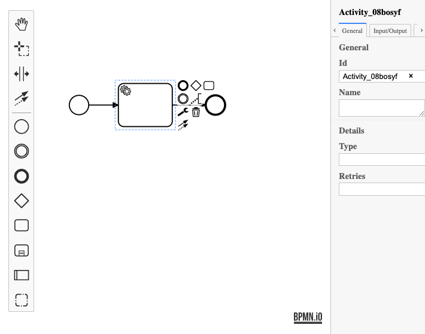

# zeebe-bpmn-js
🚧👷‍♀️👷‍♂️🚧

## Usage

```js
import Modeler from 'zeebe-bpmn-js/lib/Modeler';

const xml = '...'; // my BPMN 2.0 xml
const modeler = new Modeler({
  container: 'modeler-container',
  propertiesPanel: {
    parent: 'properties-container'
  }
});

try {
  const { warnings } = await modeler.importXML(xml);

  console.log('rendered');
} catch (err) {
  console.log('error rendering', err);
}
```



## Build and Run

Prepare the project by installing all dependencies:

```sh
npm install
```

Then, depending on your use-case you may run any of the following commands:

```sh
# build the library and run all tests
npm run all

# spin up a single local modeler instance
npm start

# spin up a single local modeler + properties panel instance
npm run start:properties

# run the full development setup
npm run dev
```

## License

MIT